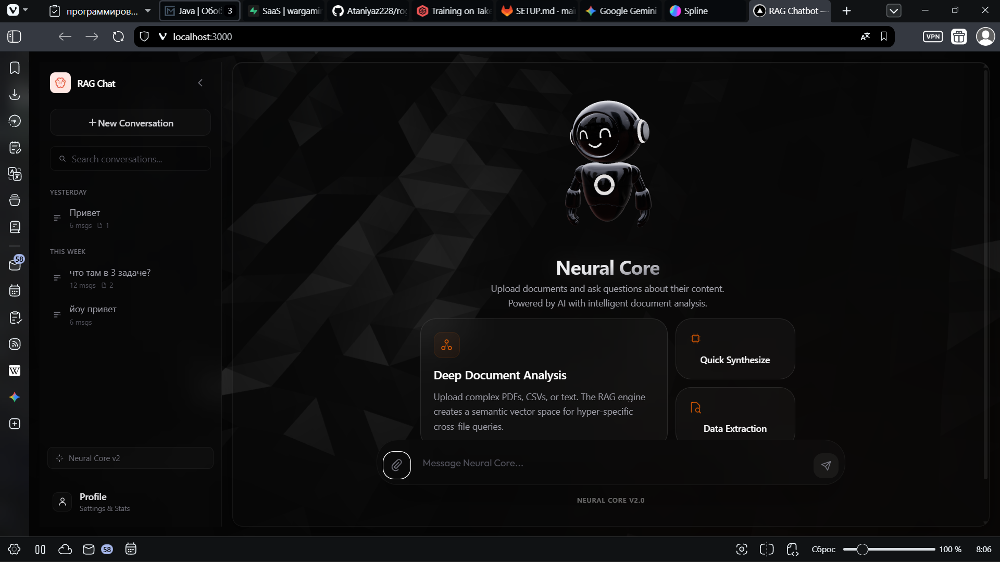
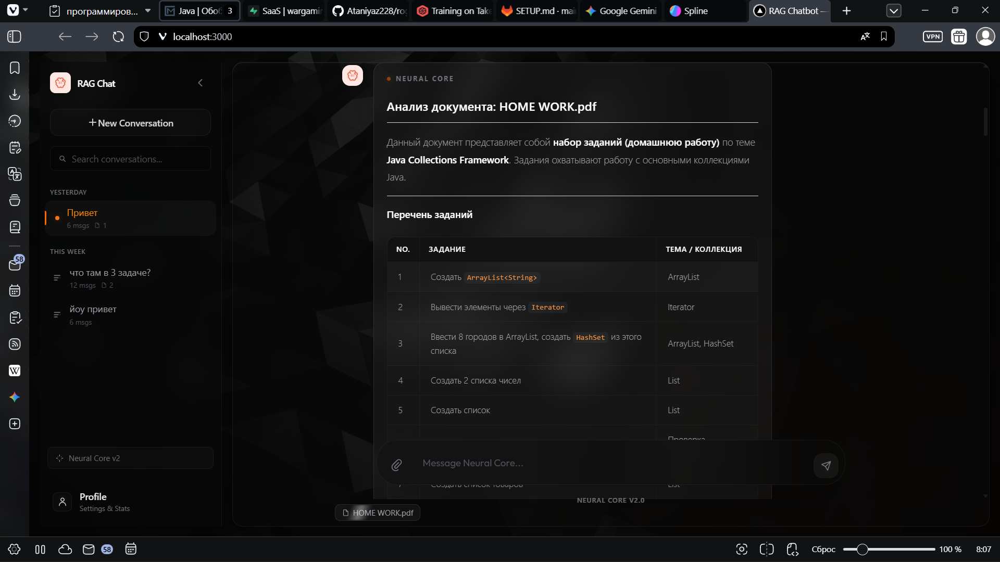
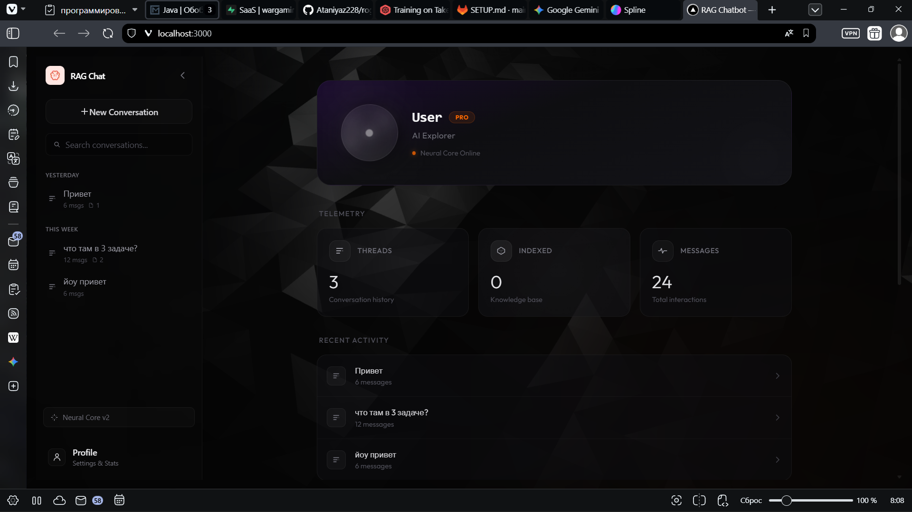

<!-- ═══════════════════════════════════════════════════════════════════════════ -->
<!--                           NEURAL CORE README                            -->
<!-- ═══════════════════════════════════════════════════════════════════════════ -->

<div align="center">

  <!-- ——— Header Badge ——— -->
  

  <!-- ——— Subtitle ——— -->
  <br />
  <p>
    
  </p>

  <!-- ——— Quick Badges ——— -->
  <p>
    
    
    
    
  </p>

  <!-- ——— Language Navigation ——— -->
  <p>
    <a href="#-overview"></a>
    <a href="#-обзор-проекта"></a>
  </p>

</div>

<br />

<!-- ═══════════════════════════════════════════════════════════════════════════ -->
<!--                              ENGLISH SECTION                             -->
<!-- ═══════════════════════════════════════════════════════════════════════════ -->

##  Overview

**Neural Core** is a production-grade Retrieval-Augmented Generation system powered by **Claude Opus 4.6**. It enables deep reasoning and analysis across private document collections through a premium dark-themed interface with 3D elements and smooth micro-interactions.

<br />

##  Key Features

<table>
  <tr>
    <td width="50%">
      <h3> Intelligence</h3>
      Powered by the most advanced <b>Claude Opus 4.6</b> model for superior reasoning and deep document comprehension.
    </td>
    <td width="50%">
      <h3> Deep Document Analysis</h3>
      Analyzes complex relationships across multiple documents with high precision using semantic vector search.
    </td>
  </tr>
  <tr>
    <td width="50%">
      <h3> Advanced RAG Engine</h3>
      Efficient vector search and context management that delivers relevant and accurate responses.
    </td>
    <td width="50%">
      <h3> Premium UI/UX</h3>
      Dark, futuristic interface with 3D animations, Framer Motion transitions, and glassmorphism effects.
    </td>
  </tr>
  <tr>
    <td width="50%">
      <h3> Smart Citations</h3>
      Automatic source tracking and section-specific references for full answer transparency.
    </td>
    <td width="50%">
      <h3> Security First</h3>
      Environment-based configuration for sensitive API keys and secure data handling.
    </td>
  </tr>
</table>

<br />

##  Demo

<div align="center">

  <!-- ——— Video Placeholder ——— -->
  <a href="YOUR_VIDEO_URL_HERE">
    
  </a>

  <br /><br />

  > Replace the link above with your hosted video URL. You can also embed the video directly:

  <!-- If hosting on GitHub, replace the src below with the raw video link -->
  <!-- <video src="./frontend/public/scrinshots/video.mp4" controls width="800"></video> -->

</div>

<br />

##  Screenshots

<div align="center">

  <!-- ——— Screenshot 1: Landing Page ——— -->
  
  <br />
  <sup><b>Landing Page</b> — 3D robot mascot, feature cards, and conversation sidebar</sup>

  <br /><br />

  <!-- ——— Screenshot 2: Chat / Document Analysis ——— -->
  
  <br />
  <sup><b>Chat Interface</b> — Semantic document analysis with structured table output and source citations</sup>

  <br /><br />

  <!-- ——— Screenshot 3: Profile Page ——— -->
  
  <br />
  <sup><b>Profile Dashboard</b> — User telemetry, conversation history, and activity tracking</sup>

</div>

<br />

##  Technology Stack

<div align="center">

  <!-- ——— Skill Icons (from tandpfun/skill-icons) ——— -->
  <a href="https://skillicons.dev">
    
  </a>

  <br /><br />

  <!-- ——— Grouped Badges ——— -->

  <table>
    <tr>
      <th align="left" width="140">Layer</th>
      <th align="left">Technologies</th>
    </tr>
    <tr>
      <td><b>Backend</b></td>
      <td>
        
        
        
        
        
      </td>
    </tr>
    <tr>
      <td><b>Frontend</b></td>
      <td>
        
        
        
        
        
        
      </td>
    </tr>
    <tr>
      <td><b>AI Core</b></td>
      <td>
        
        
      </td>
    </tr>
  </table>

</div>

<br />

##  Architecture

```
                         +-------------------+
                         |   Claude Opus 4.6 |
                         |   (Anthropic API) |
                         +---------+---------+
                                   |
                    +--------------+--------------+
                    |                             |
           +-------v--------+          +---------v--------+
           |  Spring Boot   |          |    Next.js 16    |
           |   REST API     |          |   React + Three  |
           |  (Port 8080)   |          |   (Port 3000)    |
           +-------+--------+          +------------------+
                    |
           +-------v--------+
           |  PostgreSQL    |
           |  Vector Store  |
           +----------------+
```

<br />

##  Getting Started

### Prerequisites

| Requirement | Minimum Version |
|:---|:---|
| Java | `21+` |
| Node.js | `18+` |
| PostgreSQL | `14+` |
| Anthropic API Key | Required |

### Backend Setup

```bash
# Navigate to backend
cd backend

# Create environment configuration
cat > .env << EOF
AI_API_KEY=your_claude_api_key
AI_MODEL=claude-opus-4-6-thinking
AI_BASE_URL=https://api.anthropic.com/v1
DB_PASSWORD=your_db_password
EOF

# Launch the server
./mvnw spring-boot:run
```

### Frontend Setup

```bash
# Navigate to frontend
cd frontend

# Install dependencies
npm install

# Start development server
npm run dev
```

> The application will be available at **http://localhost:3000**

<br />

##  Project Structure

```
rag-chatbot/
├── backend/                     # Spring Boot API
│   ├── src/main/java/com/ragchat/
│   │   ├── controller/          # REST endpoints
│   │   ├── model/               # Document & chunk entities
│   │   ├── repository/          # JPA repositories
│   │   └── service/             # RAG logic & AI integration
│   └── pom.xml
│
├── frontend/                    # Next.js application
│   ├── src/
│   │   ├── app/                 # App router pages
│   │   └── components/          # React components
│   │       ├── NeuralGlobe.tsx  # 3D mascot
│   │       ├── AuroraOrb.tsx    # Ambient glow effects
│   │       ├── FrostedOrb.tsx   # Glassmorphism elements
│   │       └── ScrambleText.tsx # Text scramble animation
│   └── package.json
│
└── README.md
```

<br />

<!-- ═══════════════════════════════════════════════════════════════════════════ -->
<!--                             DIVIDER                                      -->
<!-- ═══════════════════════════════════════════════════════════════════════════ -->

<div align="center">
  
</div>

<br />

<!-- ═══════════════════════════════════════════════════════════════════════════ -->
<!--                             RUSSIAN SECTION                              -->
<!-- ═══════════════════════════════════════════════════════════════════════════ -->

##  Обзор Проекта

**Neural Core** — это продакшен-система генерации с дополненной выборкой (RAG), работающая на базе **Claude Opus 4.6**. Обеспечивает глубокий анализ ваших личных коллекций документов через технологичный интерфейс с 3D-элементами, плавными анимациями и стилем glassmorphism.

<br />

##  Основные Возможности

<table>
  <tr>
    <td width="50%">
      <h3> Интеллект</h3>
      Использует самую мощную модель <b>Claude Opus 4.6</b> для превосходного анализа и глубокого понимания документов.
    </td>
    <td width="50%">
      <h3> Глубокий Анализ</h3>
      Исследует сложные связи между несколькими документами с высокой точностью через семантический поиск.
    </td>
  </tr>
  <tr>
    <td width="50%">
      <h3> Продвинутый RAG Движок</h3>
      Эффективный векторный поиск и управление контекстом для точных и релевантных ответов.
    </td>
    <td width="50%">
      <h3> Премиальный UI/UX</h3>
      Темный, футуристичный интерфейс с 3D-анимациями, переходами Framer Motion и эффектами glassmorphism.
    </td>
  </tr>
  <tr>
    <td width="50%">
      <h3> Умное Цитирование</h3>
      Автоматическое отслеживание источников и ссылки на конкретные разделы для полной прозрачности.
    </td>
    <td width="50%">
      <h3> Безопасность</h3>
      Конфигурация через переменные окружения для защиты API-ключей и безопасной обработки данных.
    </td>
  </tr>
</table>

<br />

##  Демонстрация

<div align="center">

  <a href="YOUR_VIDEO_URL_HERE">
    
  </a>

  <br /><br />

  > Замените ссылку выше на URL вашего загруженного видео.

</div>

<br />

##  Скриншоты

<div align="center">

  
  <br />
  <sup><b>Главная страница</b> — 3D-маскот робот, карточки возможностей и боковая панель разговоров</sup>

  <br /><br />

  
  <br />
  <sup><b>Интерфейс чата</b> — Семантический анализ документов со структурированным выводом и цитированием</sup>

  <br /><br />

  
  <br />
  <sup><b>Панель профиля</b> — Телеметрия пользователя, история разговоров и отслеживание активности</sup>

</div>

<br />

##  Технологический Стек

<div align="center">

  <a href="https://skillicons.dev">
    
  </a>

  <br /><br />

  <table>
    <tr>
      <th align="left" width="140">Слой</th>
      <th align="left">Технологии</th>
    </tr>
    <tr>
      <td><b>Бэкенд</b></td>
      <td>
        
        
        
        
        
      </td>
    </tr>
    <tr>
      <td><b>Фронтенд</b></td>
      <td>
        
        
        
        
        
        
      </td>
    </tr>
    <tr>
      <td><b>ИИ Ядро</b></td>
      <td>
        
        
      </td>
    </tr>
  </table>

</div>

<br />

##  Начало Работы

### Требования

| Требование | Минимальная версия |
|:---|:---|
| Java | `21+` |
| Node.js | `18+` |
| PostgreSQL | `14+` |
| Ключ Anthropic API | Обязателен |

### Настройка Бэкенда

```bash
# Перейдите в директорию бэкенда
cd backend

# Создайте файл окружения
cat > .env << EOF
AI_API_KEY=ваш_ключ_claude
AI_MODEL=claude-opus-4-6-thinking
AI_BASE_URL=https://api.anthropic.com/v1
DB_PASSWORD=пароль_бд
EOF

# Запустите сервер
./mvnw spring-boot:run
```

### Настройка Фронтенда

```bash
# Перейдите в директорию фронтенда
cd frontend

# Установите зависимости
npm install

# Запустите сервер для разработки
npm run dev
```

> Приложение будет доступно по адресу **http://localhost:3000**

<br />

<!-- ═══════════════════════════════════════════════════════════════════════════ -->
<!--                              FOOTER                                      -->
<!-- ═══════════════════════════════════════════════════════════════════════════ -->

<div align="center">
  
</div>
